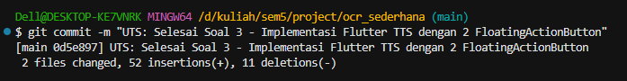

**Nama Lengkap: Diajeng Sekar Arum**

**Kelas : SIB 3F**

**NIM : 2341760070**

**UTS PRAKTIKUM PEMROGRAMAN MOBILE : APLIKASI OCR**

---------------------------------------------------------------

**Soal 1:	Modifikasi Struktur Navigasi dan Aliran**
Tujuan: Menyederhanakan alur navigasi dan meningkatkan pengalaman pengguna di
HomeScreen.

1.	Pengubahan Navigasi Home:
•	Ubah ElevatedButton di HomeScreen (lib/screens/home_screen.dart) men- jadi *widget* **ListTile**.
•	Atur ListTile: leading: Icon(Icons.camera_alt, color:	Colors.blue); title: Text(’Mulai Pindai Teks Baru’).
•	Fungsi onTap harus menggunakan Navigator.push() untuk ke ScanScreen.

2.	Teks Utuh dan Navigasi Balik (15 Poin):
•	Di ResultScreen (lib/screens/result_screen.dart), hapus fungsi ocrText.replaceAll
agar hasil teks ditampilkan dengan baris baru (\n) yang utuh.
•	Tambahkan FloatingActionButton dengan ikon Icons.home.
•	Ketika tombol ditekan, navigasi harus kembali langsung ke HomeScreen meng- gunakan **Navigator.pushAndRemoveUntil()** (atau metode yang setara) untuk menghapus semua halaman di atasnya dari stack navigasi.

**Perintah Commit Wajib (Soal 1)**
Setelah Soal 1 selesai, lakukan commit dan push dengan pesan:

git add lib/screens/home_screen.dart lib/screens/result_screen.dart 

git commit -m "UTS: Selesai Soal 1 - ListTile dan Navigasi Balik" 

git push origin main

---------------------------------------------------------------

**Soal 2: Penyesuaian Tampilan dan Penanganan State/Error**
Tujuan: Memperbaiki tampilan *loading* dan memberikan *feedback* error yang lebih jelas.

1.	Custom Loading Screen di ScanScreen:
•	Di ScanScreen (lib/screens/scan_screen.dart), modifikasi tampilan *load- ing* yang muncul sebelum kamera siap (if (!controller.value.isInitialized)) :
•	Latar Belakang:	Scaffold(backgroundColor:	Colors.grey[900]).
•	Isi:	Di dalam Center, tampilkan Column berisi CircularProgressIndicator(col Colors.yellow).
•	Di bawah indikator, tambahkan Text(’Memuat Kamera...	Harap tunggu.’, style:	TextStyle(color:	Colors.white, fontSize:	18)).

2.	Spesifikasi Pesan Error (20 Poin):
•	Di fungsi _takePicture() pada ScanScreen, modifikasi blok catch (e) un- tuk mengubah pesan *error* pada SnackBar.
•	Pesan SnackBar harus berbunyi: "Pemindaian Gagal! Periksa Izin Kamera atau coba lagi." (Hilangkan variabel *error* ($e)).

**Perintah Commit Wajib (Soal 2)**
Setelah Soal 2 selesai, lakukan commit dan push dengan pesan:

git add lib/screens/scan_screen.dart 

git commit -m "UTS: Selesai Soal 2 - Tampilan Loading dan Error"

git push origin main

---------------------------------------------------------------

**Soal 3: Implementasi Plugin Text-to-Speech (TTS)**
Tujuan:  Mengintegrasikan fitur membaca teks secara lisan menggunakan *plugin* flutter_tts.

1.	Instalasi Plugin:
•	Tambahkan *plugin* flutter_tts ke dalam file pubspec.yaml (gunakan versi terbaru yang kompatibel).

•	Jalankan flutter pub get.

2.	Konversi Widget dan Inisialisasi:
•	Ubah ResultScreen dari StatelessWidget menjadi **StatefulWidget**.
•	Di initState(), inisialisasi FlutterTts dan atur bahasa pembacaan menjadi Bahasa Indonesia.
•	Implementasikan dispose() untuk menghentikan mesin TTS saat halaman ditutup.

3.	Fungsionalitas Pembacaan:
•	Tambahkan FloatingActionButton kedua di ResultScreen (atau ganti AppBar
dengan action button) dengan ikon Icons.volume_up.
•	Ketika tombol ditekan, panggil fungsi speak() pada FlutterTts untuk mem- bacakan seluruh isi ocrText.

**Perintah Commit Wajib (Soal 3)**
Setelah Soal 3 selesai, lakukan commit dan push terakhir dengan pesan:

git add pubspec.yaml lib/screens/result_screen.dart

git commit -m "UTS: Selesai Soal 3 - Implementasi Flutter TTS dengan 2 FloatingActionButton"

git push origin main

---------------------------------------------------------------

**Hasil saat dijalankan :**
•	Run pada device ponsel :

•   Hasil saat dijalankan di ponsel :

•	Dalam hasil yang sudah dijalankan, usai dilakukan pemindaian maka teks yang dipindai akan terbaca seperti pada jobsheet 7 yang sebelumnya pernah dikerjakan. Pada pengerjaan UTS kali ini project flutter ocr memberikan tambahan text to speech dan back to home. Setelah project dijalankan diponsel, project dapat berjalan dengan baik, usai memindai, fitur text to speech dapat dijalankan dan saat ikon home diklik akan kembali lagi ke menu halaman utama. 

